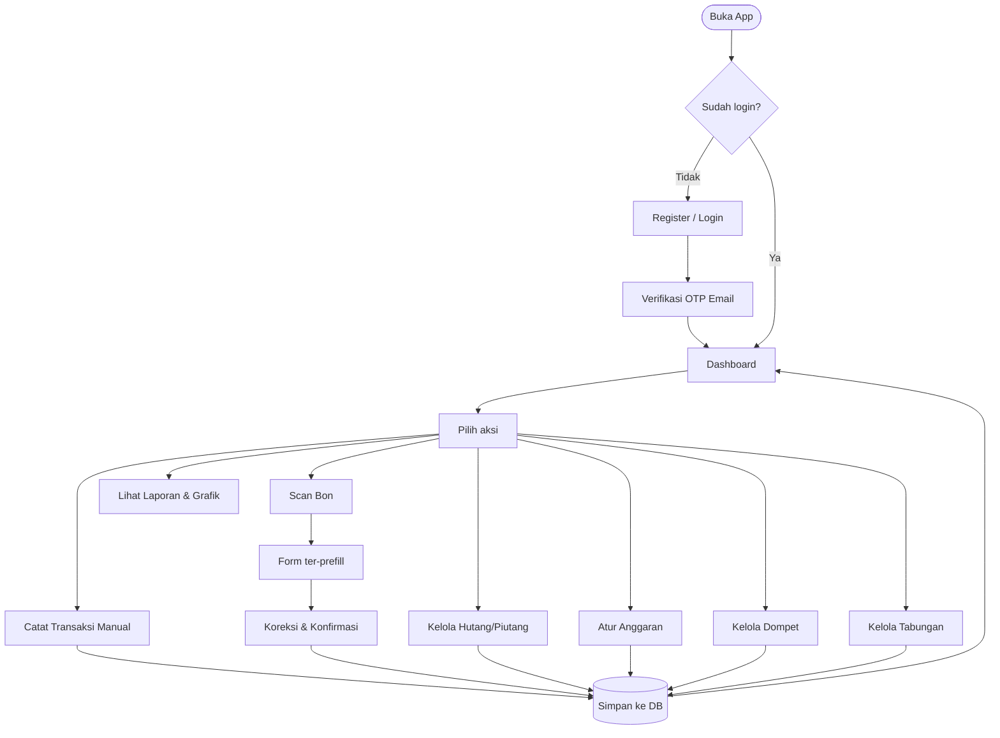
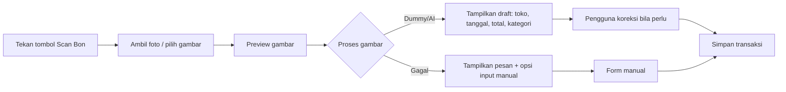
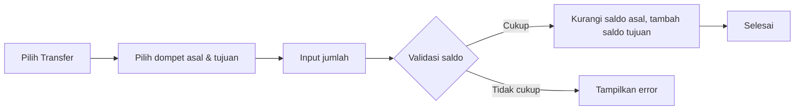
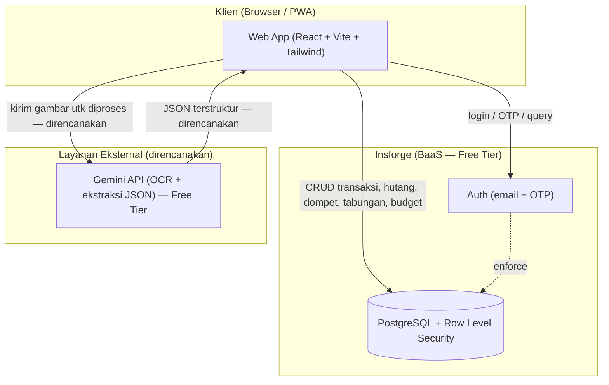
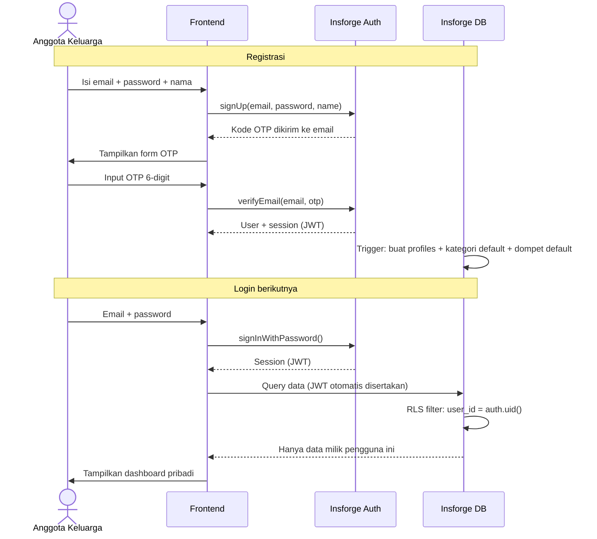
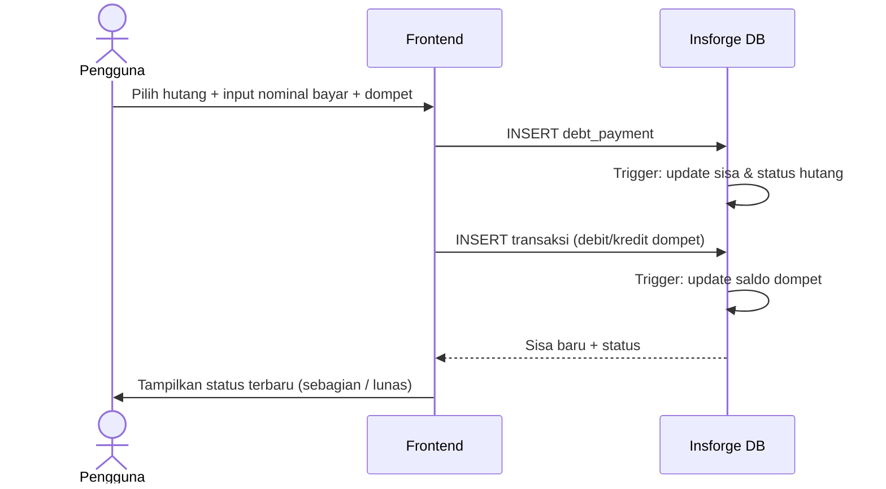
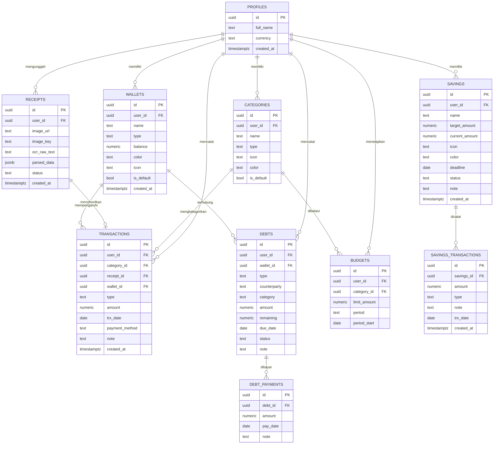

# PRD — Aplikasi Catatan Keuangan Pribadi

> **Nama kerja produk:** *DuitKu*
> **Versi dokumen:** 1.3 · **Tanggal:** 1 Juni 2026 · **Penyusun:** Fajar
> **Status:** MVP — Aktif Dikembangkan
> **Perubahan v1.2:** Dukungan **multi-akun keluarga** — tiap anggota punya akun & data keuangan terpisah/privat.
> **Perubahan v1.3:** Tambah fitur **Dompet (multi-wallet)** & **Tabungan (goal-based savings)**; ganti BaaS dari Supabase ke **Insforge**; tambah **dark mode** & **dukungan dua bahasa (ID/EN)**; perbarui skema DB dan stack teknologi sesuai implementasi aktual.

---

## 1. Overview

### 1.1 Latar Belakang
Banyak orang kesulitan mengatur keuangan pribadi karena pencatatan manual terasa merepotkan, terutama saat harus mengetik ulang detail dari struk/bon belanja. Akibatnya pencatatan sering bolong, sehingga laporan keuangan dan budgeting menjadi tidak akurat.

*DuitKu* adalah aplikasi web pencatatan keuangan **untuk perorangan** (bukan untuk perusahaan, tanpa kompleksitas akuntansi double-entry). Fokusnya: mencatat uang masuk & keluar dengan cepat, melacak hutang/piutang, mengatur anggaran, mengelola beberapa dompet, mencatat tabungan tujuan, dan melihat laporan visual. Pembeda utamanya adalah fitur **scan bon berbasis AI/OCR** yang otomatis membaca isi struk dan mengisi form transaksi.

Aplikasi ini dirancang **multi-akun** agar bisa dipakai beberapa anggota keluarga: setiap orang punya akun login sendiri dan **data keuangannya sepenuhnya privat & terpisah** — tidak ada anggota yang bisa melihat data anggota lain.

### 1.2 Problem Statement
- Pencatatan manual lambat dan sering dilewati.
- Sulit melihat ke mana uang habis (tidak ada kategorisasi).
- Hutang & piutang gampang lupa (kapan jatuh tempo, sisa berapa).
- Tidak ada gambaran apakah pengeluaran masih sesuai anggaran.
- Tidak ada alat untuk memantau saldo per dompet (tunai, bank, e-wallet).
- Tidak ada fitur untuk mengelola tabungan per tujuan.

### 1.3 Tujuan (Goals)
1. Pengguna bisa mencatat transaksi dalam < 10 detik (manual) atau < 5 detik (via scan bon).
2. Memberi gambaran keuangan yang jelas lewat grafik & laporan.
3. Melacak hutang/piutang beserta jatuh tempo dan sisa, termasuk pengaruhnya ke saldo dompet.
4. Membantu disiplin anggaran per kategori.
5. Memungkinkan pengelolaan beberapa dompet (tunai, bank, e-wallet) dengan saldo real-time.
6. Mendukung pencatatan tabungan per tujuan (goal-based savings).
7. **Seluruh layanan inti berjalan di free tier** (biaya operasional Rp0 untuk skala personal).

### 1.4 Non-Goals (di luar lingkup MVP)
- Berbagi data antar anggota / dompet keluarga bersama / role & permission. *(Multi-akun didukung, tapi tiap akun berdiri sendiri & privat.)*
- Akun perusahaan / akuntansi penuh (jurnal, neraca, laba-rugi formal).
- Integrasi otomatis ke rekening bank / e-wallet.
- Pajak, payroll, invoicing.
- Aplikasi mobile native (cukup web responsif / PWA dulu).
- Ekspor data CSV/Excel (direncanakan fase lanjut).

### 1.5 Target Pengguna
Individu dalam satu keluarga (mis. Fajar, pasangan, anak yang sudah dewasa) yang masing-masing ingin mencatat keuangan pribadi secara praktis lewat HP atau laptop, dengan akun terpisah pada satu aplikasi yang sama.

---

## 2. Requirements

### 2.1 Functional Requirements (FR)

| ID | Kebutuhan | Prioritas |
|----|-----------|-----------|
| FR-01 | **Register** akun baru (email/password) dengan verifikasi OTP via email | Must |
| FR-01a | **Login** & **logout**, dengan sesi yang persisten antar kunjungan | Must |
| FR-01b | **Reset/lupa password** via kode OTP yang dikirim ke email | Should |
| FR-01c | **Edit profil** (nama tampilan) | Should |
| FR-01d | **Hapus akun** beserta seluruh data pengguna secara permanen | Should |
| FR-01e | (Opsional) **Pendaftaran terbatas** ke daftar email keluarga (allowlist) | Could |
| FR-02 | Mencatat **pemasukan** (jumlah, tanggal, kategori, dompet, catatan) | Must |
| FR-03 | Mencatat **pengeluaran** (jumlah, tanggal, kategori, dompet, catatan) | Must |
| FR-04 | Mengelola **kategori** (default + tambah/edit/hapus kategori sendiri) | Must |
| FR-05 | Mencatat & melacak **hutang** (siapa, jumlah, jatuh tempo, sisa, status, kategori, dompet) | Must |
| FR-06 | Mencatat & melacak **piutang** (siapa, jumlah, jatuh tempo, sisa, status, kategori, dompet) | Must |
| FR-07 | Mencatat **pembayaran cicilan** hutang/piutang (sebagian/lunas) dengan update saldo dompet | Should |
| FR-08 | Membuat **anggaran (budget)** per kategori per periode (bulanan) | Must |
| FR-09 | Indikator saat anggaran hampir/sudah terlampaui | Should |
| FR-10 | **Scan bon**: foto/upload struk → form transaksi terisi otomatis (saat ini menggunakan data dummy; integrasi AI direncanakan) | Must |
| FR-11 | Pengguna dapat **mengoreksi** hasil scan sebelum disimpan | Must |
| FR-12 | **Laporan & grafik**: tren pemasukan/pengeluaran, komposisi per kategori, realisasi vs anggaran | Must |
| FR-13 | Filter & pencarian transaksi (tanggal, kategori, tipe, nominal) | Should |
| FR-14 | Ekspor data (CSV/Excel) | Could |
| FR-15 | Dashboard ringkasan (saldo dompet, total tabungan, bulan ini, hutang/piutang aktif) | Must |
| FR-16 | Mengelola **dompet (wallet)** — CRUD, tipe (tunai/bank/e-wallet/lain), warna, ikon, set default | Must |
| FR-17 | **Transfer antar dompet** dengan validasi saldo | Must |
| FR-18 | Mencatat **tabungan tujuan (goal-based savings)** — nama, target, deadline, ikon, warna | Must |
| FR-19 | **Setor & tarik** dari tabungan, terhubung ke dompet sumber/tujuan | Must |
| FR-20 | **Dark mode** toggle (tersimpan di localStorage) | Should |
| FR-21 | **Bahasa UI** — toggle Indonesia / English (tersimpan di localStorage) | Should |

### 2.2 Non-Functional Requirements (NFR)

| ID | Kebutuhan |
|----|-----------|
| NFR-01 | **Biaya**: layanan inti tetap di free tier (DB, auth, AI/OCR). |
| NFR-02 | **Responsif**: nyaman dipakai di HP (mobile-first) dan desktop. |
| NFR-03 | **Performa**: halaman utama tampil < 2 detik; proses scan bon < 8 detik (saat AI aktif). |
| NFR-04 | **Keamanan & isolasi data**: data tiap akun terisolasi total lewat **Row Level Security** (`user_id = auth.uid()`) di semua tabel — anggota keluarga tidak bisa membaca/mengubah data milik anggota lain. |
| NFR-05 | **Privasi**: pengguna diberi tahu bahwa gambar bon diproses layanan AI eksternal (lihat §8.5). |
| NFR-06 | **Konsistensi saldo**: saldo dompet di-update otomatis via **database trigger** setiap ada transaksi baru, diedit, atau dihapus. |
| NFR-07 | **Lokalisasi**: format mata uang Rupiah (Rp) dan tanggal Indonesia; dukungan teks UI Indonesia & Inggris. |
| NFR-08 | **Offline-tolerant** (opsional, fase lanjut): PWA dengan antrian sinkronisasi. |

---

## 3. Core Features

### 3.0 Autentikasi & Akun Keluarga
Setiap anggota keluarga membuat akun sendiri (email/password). Setelah registrasi, pengguna diminta verifikasi OTP 6-digit yang dikirim ke email. Setelah login, pengguna hanya melihat dan mengelola **data miliknya sendiri**. Isolasi ini ditegakkan di tingkat database (Row Level Security).

Pengelolaan akun mencakup: registrasi + OTP, login/logout, sesi persisten, lupa password (kode OTP via email), edit nama tampilan, dan hapus akun (seluruh data dihapus permanen).

Saat akun dibuat, sistem otomatis mem-provisi:
- 11 **kategori default** (Makan & Minum, Transport, Belanja, Tagihan, Hiburan, Kesehatan, Pendidikan, Lain-lain, Gaji, Bonus, Investasi)
- 3 **dompet default** (Tunai, Bank BCA, GoPay)

Karena ini untuk keluarga (bukan publik), ada opsi membatasi pendaftaran hanya ke daftar email keluarga (allowlist) — lihat §8.2.

### 3.1 Pencatatan Transaksi (Pemasukan & Pengeluaran)
Form cepat: nominal, tipe (masuk/keluar), kategori, dompet (opsional), tanggal (default hari ini), metode pembayaran (tunai/transfer/e-wallet), dan catatan. Validasi nominal > 0. Jika dompet dipilih, saldo dompet diperbarui otomatis via trigger DB saat insert, update, maupun delete transaksi.

### 3.2 Kategori
Tersedia kategori default (Makan & Minum, Transport, Belanja, Tagihan, Gaji, Bonus, dll.) yang bisa ditambah/diubah pengguna, lengkap dengan ikon & warna untuk grafik.

### 3.3 Hutang & Piutang
Satu modul dengan dua tipe (`debt` = saya berutang; `receivable` = orang berutang ke saya). Menyimpan nama pihak, total, sisa, jatuh tempo, kategori/keperluan, dompet terkait, dan status (`unpaid`/`partial`/`paid`).

Saat hutang/piutang dibuat dengan dompet:
- Hutang → membuat transaksi `income` di dompet (uang masuk karena menerima pinjaman).
- Piutang → membuat transaksi `expense` di dompet (uang keluar karena memberi pinjaman). Dompet **wajib** dipilih untuk piutang.

Setiap pembayaran mencatat `debt_payment`, otomatis mengurangi sisa via trigger DB, dan memperbarui saldo dompet. Daftar diurutkan berdasarkan jatuh tempo terdekat.

### 3.4 Budgeting
Pengguna menetapkan batas anggaran per kategori per bulan. Sistem menjumlahkan pengeluaran kategori tsb di bulan berjalan, lalu menampilkan progress bar + peringatan saat mendekati/melebihi batas.

### 3.5 Scan Bon (OCR/AI) — fitur utama
Pengguna memotret atau mengunggah struk. Sistem memproses gambar dan mengembalikan **data terstruktur**: nama toko, tanggal, total, daftar item, dan saran kategori. Hasil ini mengisi form transaksi sebagai *draft* yang **wajib dikonfirmasi/dikoreksi** pengguna sebelum disimpan.

> **Status saat ini:** UI scan bon sudah tersedia. Pemrosesan gambar saat ini menggunakan data simulasi (dummy); integrasi ke layanan AI nyata (Gemini API) direncanakan di fase berikutnya (lihat §8.5).

### 3.6 Laporan & Grafik
- **Area chart**: tren pemasukan vs pengeluaran per bulan (6 bulan terakhir).
- **Donut chart**: komposisi pengeluaran per kategori bulan berjalan.
- **Bar chart**: realisasi vs anggaran per kategori bulan berjalan.
- **Ringkasan**: total masuk, total keluar, saldo bersih.

### 3.7 Dashboard
Halaman beranda menampilkan total saldo semua dompet, total tabungan, ringkasan bulan ini (pemasukan & pengeluaran), tren keuangan mini, transaksi terbaru, status anggaran, dan hutang/piutang aktif.

### 3.8 Dompet (Multi-Wallet)
Pengguna dapat mengelola beberapa dompet dengan tipe berbeda (Tunai, Bank, E-Wallet, Lainnya). Setiap dompet memiliki nama, ikon, warna, dan saldo yang diperbarui secara otomatis. Satu dompet dapat ditandai sebagai "utama". Tersedia fitur transfer antar dompet dengan validasi saldo.

Saldo dompet diperbarui otomatis via trigger DB pada setiap:
- INSERT transaksi → tambah/kurangi saldo sesuai tipe.
- UPDATE transaksi → batalkan efek lama, terapkan efek baru.
- DELETE transaksi → kembalikan saldo.

### 3.9 Tabungan Tujuan (Goal-Based Savings)
Pengguna dapat membuat tabungan dengan nama, target nominal, deadline, ikon, dan warna. Setiap setor/tarik dicatat sebagai `savings_transaction` dan otomatis memperbarui `current_amount` via trigger DB. Saldo dompet sumber/tujuan juga turut diperbarui. Tabungan berstatus `active`, `completed` (otomatis saat target tercapai), atau `cancelled`. Saat dihapus, saldo tabungan dapat dikembalikan ke dompet pilihan.

---

## 4. User Flow

### 4.1 Alur Utama (high-level)



### 4.2 Alur Scan Bon (detail)



### 4.3 Alur Transfer Antar Dompet



---

## 5. Architecture

Arsitektur **serverless / BaaS** agar murah & mudah dirawat. Frontend langsung berbicara ke Insforge untuk auth/DB, memanggil API secara langsung.



**Komponen utama**
- **Frontend (React)** — UI, grafik, logika form, trigger CRUD.
- **Insforge Auth** — autentikasi email + OTP & sesi pengguna.
- **Insforge PostgreSQL** — penyimpanan data utama, diproteksi RLS per `user_id`.
- **Database Triggers** — menjaga konsistensi saldo dompet & current_amount tabungan secara otomatis.
- **Gemini API** *(direncanakan)* — membaca gambar bon dan mengembalikan data terstruktur.

---

## 6. Sequence Diagram

### 6.1 Registrasi & Login (Akun Keluarga)



### 6.2 Scan Bon → Catat Pengeluaran

```mermaid
sequenceDiagram
    actor U as Pengguna
    participant FE as Frontend
    participant AI as Layanan AI (direncanakan)
    participant DB as Insforge DB

    U->>FE: Foto / upload bon
    FE->>AI: Kirim gambar (direncanakan; saat ini: dummy data)
    AI-->>FE: JSON {toko, tanggal, total, item, kategori}
    FE->>U: Tampilkan form untuk dikoreksi
    U->>FE: Konfirmasi / edit
    FE->>DB: INSERT transaksi
    DB->>DB: Trigger: update saldo dompet (jika ada wallet_id)
    DB-->>FE: OK
    FE->>U: "Transaksi tersimpan"
```

### 6.3 Catat Pembayaran Hutang



---

## 7. Database Schema



### 7.1 Catatan Skema
- **`type`** pada `transactions` & `categories`: `income` | `expense`.
- **`type`** pada `wallets`: `cash` | `bank` | `ewallet` | `other`.
- **`type`** pada `debts`: `debt` (hutang) | `receivable` (piutang).
- **`type`** pada `savings_transactions`: `deposit` | `withdraw`.
- **`status`** pada `debts`: `unpaid` | `partial` | `paid`.
- **`status`** pada `receipts`: `pending` | `processed` | `failed`.
- **`status`** pada `savings`: `active` | `completed` | `cancelled`.
- Semua tabel pakai **Row Level Security**: setiap baris hanya bisa diakses oleh pemiliknya (`user_id = auth.uid()`).
- `PROFILES.id` merujuk ke `auth.users.id` (dibuat otomatis saat registrasi via trigger).
- **Tidak ada tabel "keluarga/rumah tangga"** — tiap akun berdiri sendiri.
- `UNIQUE (user_id, category_id, period)` pada `budgets` mencegah duplikasi anggaran per kategori per periode.

### 7.2 Database Triggers

| Trigger | Tabel | Efek |
|---------|-------|------|
| `on_auth_user_created` | `auth.users` INSERT | Buat baris `profiles` otomatis |
| `on_profile_created_seed_categories` | `profiles` INSERT | Seed 11 kategori default + 3 dompet default |
| `trx_insert_update_wallet` | `transactions` INSERT | Update saldo dompet |
| `trx_update_wallet` | `transactions` UPDATE | Batalkan efek lama, terapkan efek baru ke saldo dompet |
| `trx_delete_restore_wallet` | `transactions` DELETE | Kembalikan saldo dompet |
| `debt_payment_inserted` | `debt_payments` INSERT | Update `remaining` & `status` pada `debts` |
| `savings_trx_inserted` | `savings_transactions` INSERT | Update `current_amount` & `status` pada `savings` |

---

## 8. Tech Stack

### 8.1 Frontend
| Komponen | Pilihan | Alasan |
|----------|---------|--------|
| Framework | **React 19 + Vite** | Cepat, ekosistem besar, mudah jadi PWA |
| Styling | **Tailwind CSS** | Mobile-first, cepat dibangun |
| Grafik | **Recharts** | Ringan, cukup untuk area/donut/bar chart |
| State/Data | Custom `useQuery` hook + Insforge JS client | Sederhana, tidak butuh library eksternal tambahan |
| Icons | **lucide-react** | Konsisten, ringan |
| i18n | Custom translation object (`src/lib/i18n.js`) | Sederhana, mendukung ID & EN |
| Dark mode | CSS class `.dark` + localStorage | Native Tailwind dark mode |
| Routing | **React Router v7** | SPA routing standar |

### 8.2 Backend / BaaS — **Insforge (Free Tier)**
Satu platform untuk Database + Auth, sehingga tidak perlu kelola server sendiri. Diakses via `@insforge/sdk`.

**Autentikasi (Insforge Auth):**
- Provider: **Email/Password + OTP Verifikasi**.
- RLS policy di setiap tabel: `using (auth.uid() = user_id)`.
- Saat user register, profil + kategori default + dompet default dibuat otomatis via trigger.
- **Membatasi ke keluarga saja (opsional, FR-01e):** matikan open signup lalu buat akun anggota secara manual, atau gunakan trigger yang menolak email di luar allowlist.

### 8.3 OCR / AI untuk Scan Bon
Lihat rekomendasi lengkap di §8.5.

> **Status saat ini:** fitur scan bon menggunakan data simulasi (dummy). Integrasi Gemini API direncanakan pada fase berikutnya.

### 8.4 Deployment
- **Frontend:** Vercel (free tier, deploy dari GitHub otomatis). Konfigurasi `vercel.json` sudah ada.
- **Backend:** sudah ter-hosting di Insforge.
- **Biaya total skala personal:** Rp0.

### 8.5 Rekomendasi Layanan Scan Bon (gratis) ⭐

Karena syaratnya **gratis**, ini perbandingan opsi terbaik beserta trade-off-nya:

| Opsi | Tipe | Kelebihan | Kekurangan | Biaya |
|------|------|-----------|------------|-------|
| **Gemini API (Flash-Lite)** — *rekomendasi utama* | AI multimodal | Sekaligus baca **dan** memahami struk → langsung keluar JSON terstruktur (toko, tanggal, total, kategori). Akurasi tinggi, tanpa kartu kredit. | Ada batas harian (~1.000 request/hari, ~15 req/menit free tier). **Input free tier bisa dipakai Google untuk melatih model** → hindari kirim bon sangat sensitif. | Gratis (free tier) |
| **Tesseract.js** | OCR open-source | 100% gratis, jalan **di browser** (gambar tidak keluar dari perangkat → privasi terjaga), tanpa batas request. | Hanya menghasilkan **teks mentah**; butuh logika parsing sendiri. Akurasi pada struk buram lebih rendah. | Gratis selamanya |
| **OCR.space API** | OCR cloud | Mudah dipakai, ada free tier. | Teks mentah saja, batas request kecil. | Gratis (terbatas) |

**Rekomendasi:**
1. **Gunakan Gemini API (Flash-Lite) sebagai mesin utama.** Untuk pemakaian personal, batas free tier sangat berlebih.
2. **Sediakan Tesseract.js sebagai fallback/mode privasi** — berguna saat offline, kuota AI habis, atau pengguna tidak ingin gambarnya dikirim ke layanan eksternal.
3. **Selalu tampilkan hasil sebagai draft** yang bisa dikoreksi pengguna.

> 🔒 **Privasi (NFR-05):** beri tahu pengguna bahwa pada free tier Gemini, gambar/teks bon dapat digunakan untuk meningkatkan model Google. Untuk data sensitif, arahkan ke mode Tesseract (lokal).

### 8.6 Ringkasan Stack
```
Frontend : React 19 + Vite + Tailwind CSS + Recharts + lucide-react
i18n     : Custom hook (ID/EN), dark mode via localStorage
BaaS     : Insforge (PostgreSQL + Auth OTP)
AI/OCR   : Gemini API (direncanakan — utama) + Tesseract.js (direncanakan — fallback)
Deploy   : Vercel (frontend)
Biaya    : Rp0 (semua free tier untuk skala personal)
```

---

## Lampiran — Saran Tahapan Pengembangan (MVP → Lanjut)

| Fase | Fokus | Status |
|------|-------|--------|
| **Fase 1 (MVP)** | Auth multi-akun (register/OTP/login + RLS isolasi data), catat pemasukan/pengeluaran, kategori, dashboard, laporan dasar | ✅ Selesai |
| **Fase 2** | Hutang/piutang + pembayaran + integrasi dompet; budgeting + peringatan | ✅ Selesai |
| **Fase 3** | Multi-wallet (dompet), transfer antar dompet, tabungan tujuan (savings) | ✅ Selesai |
| **Fase 4** | Scan bon (integrasi Gemini API nyata), Tesseract fallback | 🚧 Dalam pengerjaan (UI siap, AI masih dummy) |
| **Fase 5** | Ekspor CSV/Excel, PWA & mode offline | 📋 Direncanakan |
